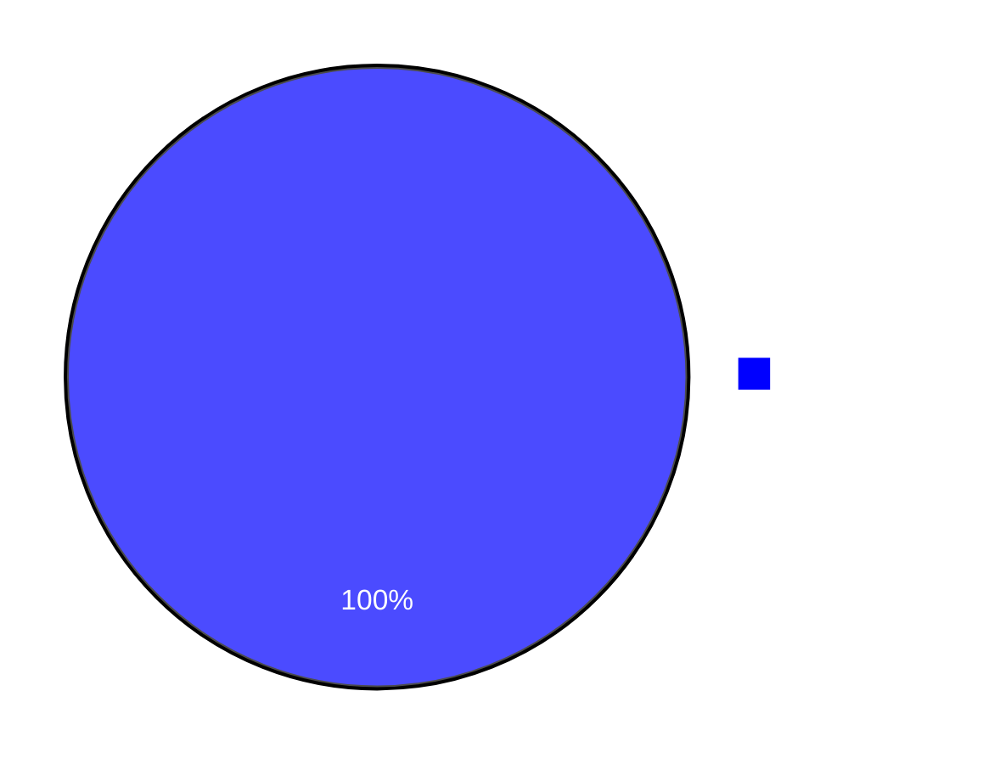
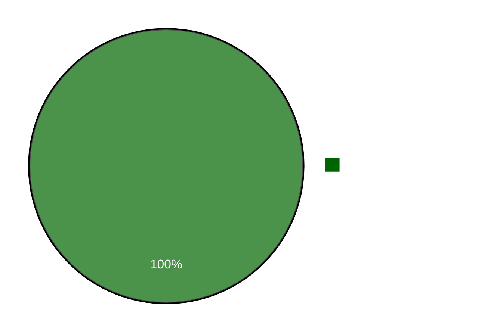

<h1 style="border-bottom: none">
    <b><a href="#">ONNET API</a></b> 
    API de Comissões CRM
     
</h1>

  A descrição a seguir é referente à API criada para a aplicação OnNet CRM Comissões  
  Nela, será apresentada toda a documentação da API.

> [!NOTE]
> A Versão do Node.js utilizada foi a V20.9.0

 

## Iniciando...

 

> [!NOTE]
> 

>   Os programas utilizados foram, Node.js, Visual Studio Code, HeidiSQL e Insomnia. 
>   Os pacotes utilizados foram o Express, Pg e Nodemon.
>   Os gráficos e toda a estilização, foi feita com a ferramenta Mermaid.
> 

## Progresso

### Check-list do Desenvolvimento

- [X] Back-end com rotas e variáveis referentes ao banco do MK
- [X] Documentação completa do back do MK, com formatação
- [ ] Back-end com rotas e variáveis referentes ao banco local
- [ ] Documentação completa do back local, com formatação

 

### Progresso de Desenvolvimento

## Rotas

### Rotas - MK

- **/api/Sale** — Recebe o código do contrato e, se dentro de um período de 4 meses, retorna o código do cliente, o nome do cliente, a cidade, o código do contrato, a data da operação, o código do operador que fez a venda, o usuário do operador, a cidade o operador, o setor do operador, o código da 1ª fatura após a operação, o valor do plano e o dia de vencimento;

- **/api/Renovation** — Recebe o código do contrato e, se dentro de um período de 4 meses, retorna o código do cliente, o nome do cliente, a cidade, o código do contrato, a data da operação, o código do operador que fez a renovação, o usuário do operador, a cidade o operador, o setor do operador, o código da 1ª fatura após a operação, o valor do plano antigo, o plano antigo, o valor do plano novo, o plano novo e o dia de vencimento;

- **/api/OperatorsCities** — Retorna todas as cidades dos operadores dos setores referentes à parte comercial sendo: Comercial, Filiais, Telemarketing e PAP ***Especificamente os códigos: 11, 13, 15 e 32***;

- **/api/OperatorsSectors** — Retorna os setores de todos os operadores dos setores: Comercial, Filiais, Telemarketing e PAP;

- **/api/SettlementDate** — Recebe o código da fatura e retorna a data de pagamento da mesma (caso tenha sido paga);

- **/api/FlatProducts** — Recebe o código do plano e retorna todos os produtos que fazem parte da composição dele;

- **/api/Recurrent** — Recebe o código da fatura e a data da operação e verifica se essa fatura está cadastrada para pagamento recorrente;

### Rotas - Local